# AI CONTEXT - ai-context-core
Automatically generated by Ai-Context-Core

## 📁 PROJECT STRUCTURE

./
    .ai_context_cache.json
    .coverage
    .dockerignore
    .gitignore
    .pre-commit-config.yaml
    AI_CONTEXT.md
    CHANGELOG.md
    ... (+13 more)
    src/
        ai_context_core/
            __init__.py
            cli.py
            analyzer/
                ai_recommendations.py
                antipatterns.py
                ast_utils.py
                dependencies.py
                engine.py
                fs_utils.py
                git_analysis.py
                ... (+4 more)
            context/
                manager.py
            config/
                defaults.yaml
                loader.py
                profiles/
                    qgis.yaml
            templates/
                initial_prompt.md
                workflows/
                    create-commit.md
                    end-session.md
                    start-session.md
                prompts/
        ai_context_core.egg-info/
            PKG-INFO
            SOURCES.txt
            dependency_links.txt
            entry_points.txt
            requires.txt
            top_level.txt
    docs/
        AiContextCore_Analysis_Report.md
        COMMIT_GUIDELINES.md
        DEVELOPMENT_LOG.m

## 🎯 ENTRY POINTS
- `.agent/scripts/skill_sync.py`
- `src/ai_context_core/cli.py`

## 🏗️ DETECTED PATTERNS
### Factory
- **AIContextManager** in `src/ai_context_core/context/manager.py` (70%)
  - _Evidence: Method 'create_optimized_prompt' matches factory naming_
  - _Evidence: Method instantiates and returns an object_
- **SummaryGenerator** in `src/ai_context_core/analyzer/reporting.py` (70%)
  - _Evidence: Method '_build_issues' matches factory naming_
  - _Evidence: Method instantiates and returns an object_
- **SummaryGenerator** in `src/ai_context_core/analyzer/reporting.py` (70%)
  - _Evidence: Method '_build_qgis' matches factory naming_
  - _Evidence: Method instantiates and returns an object_

## ⚠️ DETECTED ANTI-PATTERNS
- **src/ai_context_core/analyzer/ai_recommendations.py**
  - Magic number detected: 50
  - Magic number detected: 70
- **src/ai_context_core/analyzer/antipatterns.py**
  - Magic number detected: 20
  - Magic number detected: 25
- **src/ai_context_core/analyzer/ast_utils.py**
  - Magic number detected: 100.0
  - Magic number detected: 0.5
- **src/ai_context_core/analyzer/dependencies.py**
  - Magic number detected: 5
  - Magic number detected: 5
- **src/ai_context_core/analyzer/engine.py**
  - Magic number detected: 5
  - Magic number detected: 3

## 📈 COMPLEXITY AND METRICS
- **Total Modules**: 17
- **Lines of Code**: 4,218
- **Functions**: 253
- **Classes**: 52
- **Average Complexity**: 39.5
- **Avg Maintenance Index**: 24.1
- **Most Complex Modules**: src/ai_context_core/analyzer/patterns.py, src/ai_context_core/analyzer/ast_utils.py, src/ai_context_core/analyzer/reporting.py

## 🔗 PRIMARY DEPENDENCIES
### Third Party (most frequent):
- `ast_utils` (2 imports)
- `config` (2 imports)
- `ai_recommendations` (1 imports)
- `analyzer` (1 imports)
- `antipatterns` (1 imports)
- `click` (1 imports)
- `configparser` (1 imports)
- `context` (1 imports)
- `dependencies` (1 imports)
- `fnmatch` (1 imports)
- `fs_utils` (1 imports)
- `git_analysis` (1 imports)
- `http` (1 imports)
- `issues` (1 imports)
- `metrics` (1 imports)

## 🕸️  DEPENDENCY STRUCTURE
- **Nodes**: 17
- **Edges**: 0
- **Density**: 0.000

## 🕸️ DEPENDENCY DIAGRAM (Conceptual)

```mermaid
graph TD
    classDef module fill:#f9f,stroke:#333,stroke-width:2px;
    manager
    class manager module;
    git_analysis
    class git_analysis module;
    patterns
    class patterns module;
    metrics
    class metrics module;
    engine
    class engine module;
    antipatterns
    class antipatterns module;
    reporting
    class reporting module;
    loader
    class loader module;
    ast_utils
    class ast_utils module;
    skill_sync
    class skill_sync module;
    init
    class init module;
    secrets
    class secrets module;
    fs_utils
    class fs_utils module;
    issues
    class issues module;
    dependencies
    class dependencies module;
    ai_recommendations
    class ai_recommendations module;
    cli
    class cli module;
```

## 💡 OPTIMIZATION RECOMMENDATIONS
### PROJECT_WIDE
- **Opt**: Quality Score is low (48.4/100).
- **Opt**: Low documentation coverage (47.46%).
### src/ai_context_core/analyzer/antipatterns.py
- **complexity_refactoring**: Consider breaking down large logic
### src/ai_context_core/analyzer/ast_utils.py
- **complexity_refactoring**: Consider breaking down large logic
- **module_too_large**: Large module (560 lines)
### src/ai_context_core/analyzer/dependencies.py
- **complexity_refactoring**: Consider breaking down large logic
### src/ai_context_core/analyzer/engine.py
- **complexity_refactoring**: Consider breaking down large logic
- **module_too_large**: Large module (410 lines)

## 🔄 GIT AND EVOLUTION
### Top Hotspots:
- `src/ai_context_core/analyzer/engine.py` (18 commits)
- `src/ai_context_core/analyzer/reporting.py` (17 commits)
- `src/ai_context_core/analyzer/ast_utils.py` (13 commits)
- `src/ai_context_core/cli.py` (12 commits)
- `src/ai_context_core/analyzer/fs_utils.py` (11 commits)
### Recent Churn (30 days):
- Total lines changed: 47715

## 🔑 PROJECT KEYWORDS
- **Technologies**: .md, .py, .yaml, .json, .yml, .in, .zip, .lock