# AI CONTEXT - ai-context-core
Automatically generated by Ai-Context-Core

## 📁 PROJECT STRUCTURE

./
    .ai_context_cache.json
    .coverage
    .dockerignore
    .gitignore
    .pre-commit-config.yaml
    AI_CONTEXT.md
    ARCHITECTURE.mmd
    ... (+23 more)
    src/
        ai_context_core/
            __init__.py
            cli.py
            analyzer/
                aggregator.py
                ai_context_generator.py
                ai_recommendations.py
                antipattern_orchestrator.py
                antipatterns.py
                ast_entry_points.py
                ast_metrics.py
                ... (+24 more)
                checkers/
                    __init__.py
                    optimization_checker.py
                    security_checker.py
                    tech_debt_checker.py
                patterns_detectors/
                    __init__.py
                    base.py
                    decorator.py
                    decorator_rules.py
                    factory.py
                    observer.py
                    observer_rules.py
                    ... (+3 more)
                antipattern_detectors/
                    __init__.py
                    base.py
                    dead_code.py
                    god_object.py
    

## 🎯 ENTRY POINTS

## 📈 COMPLEXITY AND METRICS
- **Total Modules**: 107
- **Source Lines (SLOC)**: 4,351
- **Total Physical Lines**: 6,916
- **Functions**: 315
- **Classes**: 66
- **Average Complexity**: 7.2
- **Avg Maintenance Index**: 55.0
- **Most Complex Modules**: src/ai_context_core/analyzer/security_checkers/injection.py, src/ai_context_core/analyzer/patterns_detectors/observer_rules.py, src/ai_context_core/commands/doctor.py

## 🏗️ DETECTED PATTERNS
### Factory
- **DependencyAnalyzer** in `src/ai_context_core/analyzer/dependencies.py` (70%)
  - _Evidence: Method 'build_graph' matches factory naming_
  - _Evidence: Method instantiates and returns an object_
- **IssuesSummarizer** in `src/ai_context_core/analyzer/summarizers/issues.py` (70%)
  - _Evidence: Method 'build_issues' matches factory naming_
  - _Evidence: Method instantiates and returns an object_
- **IssuesSummarizer** in `src/ai_context_core/analyzer/summarizers/issues.py` (70%)
  - _Evidence: Method 'build_recommendations' matches factory naming_
  - _Evidence: Method instantiates and returns an object_

## 🔗 PRIMARY DEPENDENCIES
### Third Party (most frequent):
- `base` (12 imports)
- `constants` (12 imports)
- `ast_visitors_components` (9 imports)
- `rich` (7 imports)
- `maintenance` (6 imports)
- `patterns_components` (6 imports)
- `ast_visitors` (5 imports)
- `components` (5 imports)
- `fs_helpers` (5 imports)
- `patterns_detectors` (5 imports)
- `analyzer` (4 imports)
- `antipattern_detectors` (4 imports)
- `ast_metrics` (4 imports)
- `issues_components` (4 imports)
- `summarizers` (4 imports)

## ⚠️ UNUSED IMPORTS
- **src/ai_context_core/analyzer/aggregator_components/__init__.py**: qgis.aggregate_qgis_compliance, formatter.format_complexity_agg
- **src/ai_context_core/analyzer/ast_metrics_components/__init__.py**: sloc.calculate_sloc, halstead.calculate_halstead_metrics
- **src/ai_context_core/analyzer/ast_utils.py**: ast_visitors.extract_functions, ast_visitors.extract_classes, ast_visitors.check_docstrings, ast_visitors.extract_imports, ast_visitors.detect_unused_imports
- **src/ai_context_core/analyzer/ast_visitors.py**: ast_visitors_components.FunctionVisitor, ast_visitors_components.extract_functions, ast_visitors_components.ClassVisitor, ast_visitors_components.extract_classes, ast_visitors_components.DocstringVisitor
- **src/ai_context_core/analyzer/dependency_analyser_components/__init__.py**: classifier.classify_imports, parser.parse_dependency_files

## 🔗 HIGH COUPLING MODULES (CBO)
- **src/ai_context_core/cli_groups/maintenance.py**: CBO 6 (In: 0, Out: 6)

## 🕸️  DEPENDENCY STRUCTURE
- **Nodes**: 173
- **Edges**: 19
- **Density**: 0.001

## 🕸️ DEPENDENCY DIAGRAM (Conceptual)

```mermaid
graph TD
    singleton_rules --> py
    analysis --> py
    base --> py
    interactive --> py
    maintenance --> py
    workflows --> py
    classDef module fill:#f9f,stroke:#333,stroke-width:2px;
    formatter
    class formatter module;
    base
    class base module;
    ai_recommendations
    class ai_recommendations module;
    init
    class init module;
    analysis
    class analysis module;
    maintenance
    class maintenance module;
    audit_quality
    class audit_quality module;
    init
    class init module;
    base
    class base module;
    aggregator
    class aggregator module;
    check_complexity
    class check_complexity module;
    interactive
    class interactive module;
    workflows
    class workflows module;
    singleton_rules
    class singleton_rules module;
    check_docs
    class check_docs module;
    init
    class init module;
    qgis
    class qgis module;
    dead_code
    class dead_code module;
    skill_sync
    class skill_sync module;
    ai_context_generator
    class ai_context_generator module;
```

## 💡 OPTIMIZATION RECOMMENDATIONS
### src/ai_context_core/analyzer/engine.py
- **complexity_refactoring**: Consider breaking down large logic
### src/ai_context_core/analyzer/patterns_detectors/observer_rules.py
- **complexity_refactoring**: Consider breaking down large logic
### src/ai_context_core/analyzer/security_checkers/injection.py
- **complexity_refactoring**: Consider breaking down large logic
### src/ai_context_core/cli_groups/interactive.py
- **complexity_refactoring**: Consider breaking down large logic
### src/ai_context_core/commands/doctor.py
- **complexity_refactoring**: Consider breaking down large logic

## 🔄 GIT AND EVOLUTION
### Top Hotspots:
- `src/ai_context_core/analyzer/engine.py` (26 commits)
- `src/ai_context_core/analyzer/fs_utils.py` (23 commits)
- `src/ai_context_core/analyzer/issues.py` (21 commits)
- `src/ai_context_core/analyzer/reporting.py` (21 commits)
- `src/ai_context_core/cli.py` (20 commits)
### Recent Churn (30 days):
- Total lines changed: 147559

## 🔑 PROJECT KEYWORDS
- **Technologies**: .py, .md, .json, .yaml, .yml, .toml, .in, .zip