# AI CONTEXT - ai-context-core
Automatically generated by Ai-Context-Core

## 📁 PROJECT STRUCTURE

./
    .ai_context_cache.json
    .coverage
    .dockerignore
    .gitignore
    .pre-commit-config.yaml
    AI_CONTEXT.md
    CHANGELOG.md
    ... (+20 more)
    src/
        ai_context_core/
            __init__.py
            cli.py
            analyzer/
                aggregator.py
                ai_context_generator.py
                ai_recommendations.py
                antipattern_orchestrator.py
                antipatterns.py
                ast_entry_points.py
                ast_metrics.py
                ... (+24 more)
                checkers/
                    __init__.py
                    optimization_checker.py
                    security_checker.py
                    tech_debt_checker.py
                patterns_detectors/
                    __init__.py
                    base.py
                    decorator.py
                    decorator_rules.py
                    factory.py
                    observer.py
                    observer_rules.py
                    ... (+2 more)
                antipattern_detectors/
                    __init__.py
                    base.py
                    dead_code.py
                    god_object.py
        

## 🎯 ENTRY POINTS

## 📈 COMPLEXITY AND METRICS
- **Total Modules**: 125
- **Source Lines (SLOC)**: 3,207
- **Total Physical Lines**: 5,198
- **Functions**: 283
- **Classes**: 59
- **Average Complexity**: 5.2
- **Avg Maintenance Index**: 61.5
- **Most Complex Modules**: .agent/scripts/skill_sync.py, src/ai_context_core/analyzer/patterns_detectors/observer_components/class_analyzer.py, src/ai_context_core/analyzer/git_analysis_components/parser.py

## 🏗️ DETECTED PATTERNS
No clear design patterns detected.

## 🔗 PRIMARY DEPENDENCIES
### Third Party (most frequent):
- `base` (10 imports)
- `constants` (10 imports)
- `ast_visitors` (5 imports)
- `legacy` (5 imports)
- `patterns_detectors` (5 imports)
- `antipattern_detectors` (4 imports)
- `ast_metrics` (4 imports)
- `checkers` (4 imports)
- `imports` (4 imports)
- `logic` (4 imports)
- `summarizers` (4 imports)
- `analysis` (3 imports)
- `analyzer` (3 imports)
- `builders` (3 imports)
- `graph` (3 imports)

## ⚠️ UNUSED IMPORTS
- **src/ai_context_core/analyzer/aggregator_components/__init__.py**: qgis.aggregate_qgis_compliance, formatter.format_complexity_agg
- **src/ai_context_core/analyzer/ast_metrics_components/__init__.py**: sloc.calculate_sloc, halstead.calculate_halstead_metrics
- **src/ai_context_core/analyzer/ast_qgis_components/__init__.py**: visitor.GenericQGISComplianceVisitor, logic.is_qgis_entry_point_node, logic.check_qgis_compliance
- **src/ai_context_core/analyzer/ast_utils.py**: ast_visitors.extract_functions, ast_visitors.extract_classes, ast_visitors.check_docstrings, ast_visitors.extract_imports, ast_visitors.detect_unused_imports
- **src/ai_context_core/analyzer/ast_visitors_components/__init__.py**: functions.FunctionVisitor, functions.extract_functions, classes.ClassVisitor, classes.extract_classes, docstrings.DocstringVisitor

## 🕸️  DEPENDENCY STRUCTURE
- **Nodes**: 174
- **Edges**: 12
- **Density**: 0.000

## 🕸️ DEPENDENCY DIAGRAM (Conceptual)

```mermaid
graph TD
    check_complexity --> py
    analysis --> py
    base --> py
    reports --> py
    specialized --> py
    classDef module fill:#f9f,stroke:#333,stroke-width:2px;
    dead_code
    class dead_code module;
    spaghetti_code
    class spaghetti_code module;
    reports
    class reports module;
    specialized
    class specialized module;
    magic_number
    class magic_number module;
    ai_recommendations
    class ai_recommendations module;
    ai_context_generator
    class ai_context_generator module;
    base
    class base module;
    formatter
    class formatter module;
    base
    class base module;
    aggregator
    class aggregator module;
    init
    class init module;
    init
    class init module;
    qgis
    class qgis module;
    init
    class init module;
    audit_quality
    class audit_quality module;
    skill_sync
    class skill_sync module;
    analysis
    class analysis module;
    god_object
    class god_object module;
    check_complexity
    class check_complexity module;
```

## 🔄 GIT AND EVOLUTION
### Top Hotspots:
- `src/ai_context_core/analyzer/engine.py` (25 commits)
- `src/ai_context_core/analyzer/reporting.py` (20 commits)
- `src/ai_context_core/analyzer/ast_utils.py` (19 commits)
- `src/ai_context_core/analyzer/issues.py` (18 commits)
- `src/ai_context_core/cli.py` (18 commits)
### Recent Churn (30 days):
- Total lines changed: 103309

## 🔑 PROJECT KEYWORDS
- **Technologies**: .py, .md, .json, .yaml, .yml, .toml, .in, .zip