# AI CONTEXT - ai-context-core
Automatically generated by Ai-Context-Core

## 📁 PROJECT STRUCTURE

./
    .ai_context_cache.json
    .coverage
    .dockerignore
    .gitignore
    .pre-commit-config.yaml
    AI_CONTEXT.md
    CHANGELOG.md
    ... (+14 more)
    src/
        ai_context_core/
            __init__.py
            cli.py
            analyzer/
                ai_recommendations.py
                antipatterns.py
                ast_entry_points.py
                ast_metrics.py
                ast_qgis.py
                ast_security.py
                ast_utils.py
                ... (+15 more)
                checkers/
                    __init__.py
                    optimization_checker.py
                    security_checker.py
                    tech_debt_checker.py
            context/
                manager.py
            config/
                defaults.toml
                defaults.yaml
                loader.py
                profiles/
                    qgis.yaml
            templates/
                initial_prompt.md
                workflows/
                    create-commit.md
                    end-session.md
                    start-session.md
                prompts/
        ai_context_core.egg-info/
            PKG-INFO
            SOURCES

## 🎯 ENTRY POINTS
- `.agent/scripts/skill_sync.py`
- `src/ai_context_core/cli.py`

## 🏗️ DETECTED PATTERNS
### Factory
- **SummaryGenerator** in `src/ai_context_core/analyzer/summary_generator.py` (70%)
  - _Evidence: Method '_build_issues' matches factory naming_
  - _Evidence: Method instantiates and returns an object_
- **SummaryGenerator** in `src/ai_context_core/analyzer/summary_generator.py` (70%)
  - _Evidence: Method '_build_qgis' matches factory naming_
  - _Evidence: Method instantiates and returns an object_
- **SummaryGenerator** in `src/ai_context_core/analyzer/summary_generator.py` (70%)
  - _Evidence: Method '_build_recommendations' matches factory naming_
  - _Evidence: Method instantiates and returns an object_

## ⚠️ DETECTED ANTI-PATTERNS
- **src/ai_context_core/analyzer/ai_recommendations.py**
  - Magic number detected: 100
- **src/ai_context_core/analyzer/antipatterns.py**
  - Magic number detected: 20
  - Magic number detected: 25
- **src/ai_context_core/analyzer/constants.py**
  - Magic number detected: 5
  - Magic number detected: 15
- **src/ai_context_core/analyzer/fs_utils.py**
  - Magic number detected: 256
  - Magic number detected: 4
- **src/ai_context_core/analyzer/git_analysis.py**
  - Magic number detected: 5
  - Magic number detected: 1000

## 📈 COMPLEXITY AND METRICS
- **Total Modules**: 33
- **Lines of Code**: 5,033
- **Functions**: 284
- **Classes**: 58
- **Average Complexity**: 22.5
- **Avg Maintenance Index**: 34.7
- **Most Complex Modules**: src/ai_context_core/analyzer/patterns.py, src/ai_context_core/analyzer/engine.py, src/ai_context_core/analyzer/dependencies.py

## 🔗 PRIMARY DEPENDENCIES
### Third Party (most frequent):
- `constants` (12 imports)
- `ast_visitors` (9 imports)
- `ast_metrics` (5 imports)
- `checkers` (4 imports)
- `ast_entry_points` (3 imports)
- `ast_qgis` (3 imports)
- `reporting` (3 imports)
- `ast_security` (2 imports)
- `ast_utils` (2 imports)
- `config` (2 imports)
- `BaseChecker` (1 imports)
- `ai_recommendations` (1 imports)
- `analyzer` (1 imports)
- `antipatterns` (1 imports)
- `click` (1 imports)

## ⚠️ UNUSED IMPORTS
- **src/ai_context_core/analyzer/ast_utils.py**: typing.Any, typing.List, typing.Dict, ast_visitors.FunctionVisitor, ast_visitors.ClassVisitor
- **src/ai_context_core/analyzer/checkers/__init__.py**: typing.Optional
- **src/ai_context_core/analyzer/checkers/security_checker.py**: ast
- **src/ai_context_core/analyzer/ast_qgis.py**: typing.List
- **verify_compat.py**: ai_context_core.analyzer.ast_utils.extract_functions, ai_context_core.analyzer.ast_utils.extract_classes, ai_context_core.analyzer.ast_utils.calculate_complexity, ai_context_core.analyzer.ast_utils.is_entry_point

## 🕸️  DEPENDENCY STRUCTURE
- **Nodes**: 33
- **Edges**: 1
- **Density**: 0.001

## 🕸️ DEPENDENCY DIAGRAM (Conceptual)

```mermaid
graph TD
    verify_compat --> py
    classDef module fill:#f9f,stroke:#333,stroke-width:2px;
    fs_utils
    class fs_utils module;
    pattern_utils
    class pattern_utils module;
    constants
    class constants module;
    import_visitor
    class import_visitor module;
    reporting
    class reporting module;
    verify_compat
    class verify_compat module;
    cli
    class cli module;
    ai_recommendations
    class ai_recommendations module;
    git_analysis
    class git_analysis module;
    summary_generator
    class summary_generator module;
    manager
    class manager module;
    metrics
    class metrics module;
    skill_sync
    class skill_sync module;
    init
    class init module;
    complexity_visitor
    class complexity_visitor module;
    patterns
    class patterns module;
    secrets
    class secrets module;
    html_builder
    class html_builder module;
    antipatterns
    class antipatterns module;
    loader
    class loader module;
```

## 💡 OPTIMIZATION RECOMMENDATIONS
### PROJECT_WIDE
- **Opt**: Quality Score (54.9/100) has room for improvement.
### src/ai_context_core/analyzer/antipatterns.py
- **complexity_refactoring**: Consider breaking down large logic
### src/ai_context_core/analyzer/fs_utils.py
- **complexity_refactoring**: Consider breaking down large logic
- **module_too_large**: Large module (447 lines)
### src/ai_context_core/analyzer/git_analysis.py
- **complexity_refactoring**: Consider breaking down large logic
### src/ai_context_core/analyzer/metrics.py
- **complexity_refactoring**: Consider breaking down large logic

## 🔄 GIT AND EVOLUTION
### Top Hotspots:
- `src/ai_context_core/analyzer/engine.py` (19 commits)
- `src/ai_context_core/analyzer/reporting.py` (18 commits)
- `src/ai_context_core/analyzer/ast_utils.py` (14 commits)
- `src/ai_context_core/cli.py` (13 commits)
- `src/ai_context_core/analyzer/fs_utils.py` (12 commits)
### Recent Churn (30 days):
- Total lines changed: 50704

## 🔑 PROJECT KEYWORDS
- **Technologies**: .md, .py, .yaml, .json, .yml, .toml, .in, .zip