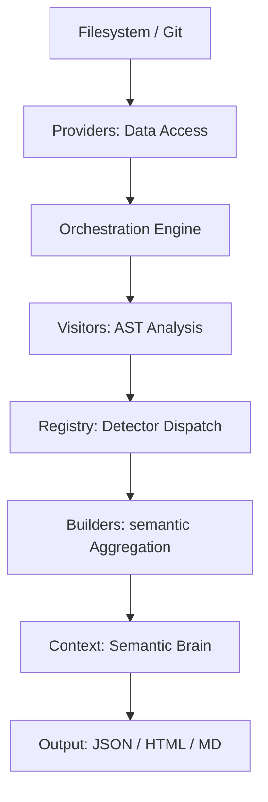

# Architecture of AI-Context-Core

This document describes the technical architecture of **AI-Context-Core**, focusing on its modular design, AST-driven analysis, and parallel execution model.

## 🏗️ System Overview

AI-Context-Core is designed as a **Semantic Extraction Pipeline**. It transforms raw source code into a structured, AI-ready knowledge base through multiple stages of analysis and aggregation.

## 📂 Core Architecture Layers

### 🔍 Extraction Layer (`analyzer/visitors/`)
The primary intelligence layer of the system.
- **Visitor Pattern**: Uses the standard `ast.NodeVisitor` to traverse source code.
- **Detector Registry**: A specialized registry that allows registering new architectural or security hot-spots dynamically without modifying the engine.
- **Isolation**: Each visitor is stateless, ensuring thread/process safety during parallel execution.

### ⚙️ Orchestration Layer (`analyzer/engine.py`)
The heart of the system that coordinates analysis tasks.
- **Parallel Workers**: Dispatches file analysis across multiple CPU cores using `ProcessPoolExecutor`, bypassing the Python GIL for CPU-bound AST tasks.
- **Incremental Caching**: Implements a hybrid caching system based on file `mtime` and SHA-256 hashes to skip analysis for unchanged files.
- **Task Batching**: Groups small files into batches to minimize inter-process communication overhead.

### 🏗️ Aggregation Layer (`analyzer/builders/`)
Transforms raw visitor findings into high-level metrics and reports.
- **Metric Calculators**: Implements algorithms for Maintenance Index (MI), Cyclomatic Complexity, and Halstead Metrics.
- **Dependency Graph Engine**: Builds an internal model of module relationships, performs cycle detection, and calculates coupling metrics (CBO).
- **Template System**: Uses `Jinja2` to generate interactive HTML reports and structured Markdown summaries.

### 💻 CLI Layer (`cli/`)
The interface for human and automated users.
- **Command Pattern**: Every action (`analyze`, `audit`, `security`) is an isolated handler invoked by a centralized Click-based entry point.
- **Profiles**: Manages domain-specific configuration (e.g., QGIS vs. Generic Python) through a flexible profile system, primarily using **TOML** as the standard format.

## 🚀 Key Design Patterns

### 1. Visitor Pattern
Used to decouple the AST traversal from the specific rules being checked. This allows adding a new checker (e.g., "Circular Import Detector") by simply adding a new visitor node handler.

### 2. Command Pattern
Decouples the CLI front-end from the analyzer business logic. The CLI interprets flags and maps them to specialized `ActionHandlers`.

### 3. Registry & Factory
Detectors and exporters are registered in a centralized `Registry`. This enables "plug-and-play" capabilities where new features are automatically discovered by the engine.

## ⚙️ Concurrency & Performance

AI-Context-Core optimizes performance through:
1.  **Process Isolation**: Each analysis task runs in its own process, preventing memory leaks from affecting the main controller.
2.  **Shared Memory (Partial)**: Heavy results are serialized to JSON only when strictly necessary.
3.  **Heuristic Scaling**: The engine automatically detects CPU core count and project size to determine the optimal number of workers.

## 🧠 Semantic Context Strategy

Unlike simple code greppers, AI-Context-Core maintains a **Persistent Context** (`project_context.json`). This file acts as the project's "Long Term Memory", allowing AI agents to:
- Understand architectural evolution.
- Track technical debt trends.
- Make informed refactoring recommendations based on historical hotspots.

---
**Version**: 3.2.0 | **License**: GPL v3 | **Status**: Modular Refactor Complete
