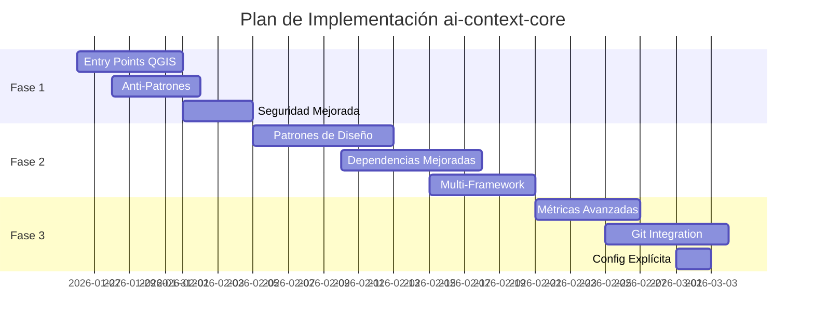

# Plan de Implementación - Mejoras ai-context-core

Basado en el análisis detallado en [AiContextCore_Analysis_Report.md](file:///home/jmbernales/qgispluginsdev/ai-context-core/docs/AiContextCore_Analysis_Report.md)

## Objetivo

Implementar mejoras críticas en `ai-context-core` para corregir deficiencias actuales y agregar funcionalidades de análisis avanzado que mejoren significativamente la calidad del contexto generado para LLMs y desarrolladores.

## User Review Required

> [!IMPORTANT]
> **Priorización de Fases**: El plan está dividido en 4 fases. Se recomienda comenzar con la Fase 1 (mejoras críticas de 11-15 horas). ¿Deseas proceder con todas las fases o enfocarnos solo en la Fase 1?

> [!WARNING]
> **Cambios Arquitectónicos**: Las mejoras 2, 4 y 10 requieren crear nuevos módulos (`patterns.py`, mejoras en `dependencies.py`). Esto puede afectar la estructura actual del paquete.

> [!CAUTION]
> **Testing Extensivo Requerido**: Cada mejora requerirá tests unitarios adicionales. El suite actual tiene solo 7 tests, necesitaremos expandirlo significativamente.

## Proposed Changes

### Fase 1: Correcciones Críticas (Sprint 1-2 semanas)
**Esfuerzo Total**: 11-15 horas | **Prioridad**: 🔥 Alta

---

#### 1. Mejora de Detección de Entry Points

##### [MODIFY] [ast_utils.py](file:///home/jmbernales/qgispluginsdev/ai-context-core/src/ai_context_core/analyzer/ast_utils.py)

**Cambios**:
- Agregar función `is_entry_point()` que detecte:
  - `if __name__ == "__main__"` (existente)
  - `classFactory(iface)` para plugins QGIS
  - Decoradores CLI (`@click.command`, `@app.route`, etc.)
- Refactorizar `has_main_guard()` para ser parte de `is_entry_point()`

**Beneficio**: Detección correcta de entry points en plugins QGIS y frameworks web

**Esfuerzo**: 4-6 horas

---

#### 2. Detección de Anti-Patrones

##### [NEW] [antipatterns.py](file:///home/jmbernales/qgispluginsdev/ai-context-core/src/ai_context_core/analyzer/antipatterns.py)

**Funcionalidades**:
- `detect_god_object()`: Clases con >20 métodos públicos
- `detect_spaghetti_code()`: Funciones con CC >25
- `detect_magic_numbers()`: Constantes hardcodeadas sin asignación
- `detect_dead_code()`: Funciones/clases nunca importadas

**Integración**: Agregar sección "Anti-Patterns" en `AI_CONTEXT.md` y `project_context.json`

**Esfuerzo**: 4-5 horas

---

#### 3. Análisis de Seguridad Mejorado

##### [MODIFY] [issues.py](file:///home/jmbernales/qgispluginsdev/ai-context-core/src/ai_context_core/analyzer/issues.py)

**Nuevas detecciones**:
- Llamadas peligrosas: `eval`, `exec`, `pickle.loads`, `os.system`, `__import__`
- SQL injection: f-strings con "SELECT"
- Excepciones genéricas: `except:` sin tipo
- `assert` en código de producción

**Beneficio**: Alertas de seguridad más completas

**Esfuerzo**: 3-4 horas

---

### Fase 2: Análisis Avanzado (Sprint 2-3 semanas)
**Esfuerzo Total**: 19-22 horas | **Prioridad**: 🔥 Alta

---

#### 4. Implementación de Patrones de Diseño

##### [NEW] [patterns.py](file:///home/jmbernales/qgispluginsdev/ai-context-core/src/ai_context_core/analyzer/patterns.py)

**Patrones detectables**:
- **Singleton**: `_instance` + `__new__` sobrecargado (confianza: 90%)
- **Factory**: Funciones que retornan diferentes tipos (confianza: 70%)
- **Observer**: `pyqtSignal` o callbacks (confianza: 85%)
- **Strategy**: Clase base abstracta + implementaciones (confianza: 75%)
- **Decorator**: Funciones que retornan funciones (confianza: 80%)

**Funciones principales**:
- `detect_singleton(tree, module_path) -> Dict[str, Any]`
- `detect_factory(tree, module_path) -> Dict[str, Any]`
- `detect_observer_pattern(tree, module_path) -> Dict[str, Any]`
- `detect_strategy_pattern(tree, module_path) -> Dict[str, Any]`
- `detect_decorator_pattern(tree, module_path) -> Dict[str, Any]`

##### [MODIFY] [engine.py](file:///home/jmbernales/qgispluginsdev/ai-context-core/src/ai_context_core/analyzer/engine.py)

**Cambios**:
- Importar módulo `patterns`
- En `_aggregate_results()`, agregar análisis de patrones
- Reemplazar `"patterns": {}` con resultados reales

**Esfuerzo**: 8 horas

---

#### 5. Análisis de Dependencias Mejorado

##### [MODIFY] [dependencies.py](file:///home/jmbernales/qgispluginsdev/ai-context-core/src/ai_context_core/analyzer/dependencies.py)

**Nuevas funcionalidades**:
- Detectar dependencias circulares usando algoritmos de grafos
- Calcular métricas de acoplamiento (CBO - Coupling Between Objects)
- Identificar imports no utilizados
- Comparar versiones con PyPI (opcional, requiere requests)

**Nuevas funciones**:
- `detect_circular_dependencies(import_graph) -> List[List[str]]`
- `calculate_coupling_metrics(modules_data) -> Dict[str, int]`
- `find_unused_imports(tree, module_path) -> List[str]`

**Esfuerzo**: 6-8 horas

---

#### 6. Soporte Multi-Framework

##### [MODIFY] [ast_utils.py](file:///home/jmbernales/qgispluginsdev/ai-context-core/src/ai_context_core/analyzer/ast_utils.py)

**Frameworks soportados**:
- **Django**: `settings.py`, `INSTALLED_APPS`, `urlpatterns`
- **Flask**: `@app.route`
- **FastAPI**: `@app.get`, `@app.post`
- **Click**: `@click.command`
- **QGIS**: `classFactory(iface)` (ya incluido en mejora 1)

**Nueva función**:
- `detect_framework_entry_points(tree) -> List[Tuple[str, str]]`
  - Retorna: `[(nombre_funcion, tipo_framework), ...]`

**Esfuerzo**: 5-6 horas

---

### Fase 3: Métricas y Contexto (Sprint 1-2 semanas)
**Esfuerzo Total**: 13-15 horas | **Prioridad**: ⚡ Media

---

#### 7. Métricas de Mantenibilidad Avanzadas

##### [MODIFY] [metrics.py](file:///home/jmbernales/qgispluginsdev/ai-context-core/src/ai_context_core/analyzer/metrics.py)

**Nuevas métricas**:
- **Índice de Mantenibilidad (MI)**:
  ```
  MI = 171 - 5.2*ln(HV) - 0.23*CC - 16.2*ln(LOC)
  ```
- **Deuda Técnica en Horas**:
  - CC alto: 0.5h por punto sobre umbral
  - Sin docstrings: 0.25h por función
  - Sin type hints: 0.15h por función
- **Tendencia de Calidad**: Comparar con histórico

**Nuevas funciones**:
- `calculate_maintainability_index(module_data) -> float`
- `estimate_technical_debt_hours(issues) -> float`
- `compare_with_history(current_metrics, history_file) -> Dict`

**Esfuerzo**: 5-6 horas

---

#### 8. Integración con Git

##### [NEW] [git_analysis.py](file:///home/jmbernales/qgispluginsdev/ai-context-core/src/ai_context_core/analyzer/git_analysis.py)

**Funcionalidades**:
- Analizar hotspots (archivos con más commits)
- Calcular churn rate (frecuencia de cambios)
- Identificar ownership (autores principales)
- Destacar cambios recientes

**Funciones principales**:
- `analyze_git_hotspots(project_path, months=6) -> List[Tuple[str, int]]`
- `calculate_churn_rate(project_path) -> Dict[str, float]`
- `get_file_ownership(project_path) -> Dict[str, List[str]]`

**Requisito**: Proyecto debe ser un repositorio Git

**Esfuerzo**: 6-7 horas

---

#### 9. Configuración Explícita de Entry Points

##### [MODIFY] [loader.py](file:///home/jmbernales/qgispluginsdev/ai-context-core/src/ai_context_core/config/loader.py)

**Cambios**:
- Agregar soporte para campo `entry_points` en configuración
- Permitir definición manual en `.ai-context/config.yaml`

##### [NEW] Ejemplo de configuración

```yaml
# .ai-context/config.yaml
entry_points:
  - sec_interp/sec_interp_plugin.py
  - sec_interp/core/services/geology_service.py
```

##### [MODIFY] [engine.py](file:///home/jmbernales/qgispluginsdev/ai-context-core/src/ai_context_core/analyzer/engine.py)

**Cambios**:
- Combinar entry points detectados automáticamente con los configurados manualmente

**Esfuerzo**: 2 horas

---

### Fase 4: Optimización y Futuro (Backlog)
**Esfuerzo Total**: 26-33 horas | **Prioridad**: 🟢 Baja / 🚀 Futuro

---

#### 10. Cache Incremental

##### [NEW] [cache.py](file:///home/jmbernales/qgispluginsdev/ai-context-core/src/ai_context_core/analyzer/cache.py)

**Funcionalidad**: Análisis incremental basado en hash de archivos

**Beneficio**: Análisis 10x más rápido en proyectos grandes

**Esfuerzo**: 8-10 horas

---

#### 11. Generación de Diagramas Arquitectónicos

##### [MODIFY] [reporting.py](file:///home/jmbernales/qgispluginsdev/ai-context-core/src/ai_context_core/analyzer/reporting.py)

**Nuevos diagramas Mermaid**:
- Diagrama de clases
- Diagrama de componentes
- Heatmap de complejidad

**Esfuerzo**: 8-10 horas

---

#### 12. Exportación en Múltiples Formatos

##### [NEW] [exporters/](file:///home/jmbernales/qgispluginsdev/ai-context-core/src/ai_context_core/exporters/)

**Formatos**:
- HTML interactivo (Chart.js)
- PDF (reportlab)
- SARIF (integración VSCode)
- Badge SVG para README

**Esfuerzo**: 6-8 horas

---

#### 13. Recomendaciones Accionables con IA

##### [NEW] [ai_recommendations.py](file:///home/jmbernales/qgispluginsdev/ai-context-core/src/ai_context_core/analyzer/ai_recommendations.py)

**Funcionalidad**: Integración con LLMs para sugerencias de refactoring

**Esfuerzo**: 12-15 horas

---

## Testing Strategy

### Tests Nuevos Requeridos

Para cada mejora, crear tests en `tests/`:

1. **test_entry_points.py**: Validar detección de QGIS, Click, Flask, FastAPI
2. **test_antipatterns.py**: Validar detección de God Object, Magic Numbers, etc.
3. **test_patterns.py**: Validar detección de Singleton, Factory, Observer, etc.
4. **test_security_enhanced.py**: Validar nuevas detecciones de seguridad
5. **test_dependencies_advanced.py**: Validar detección de ciclos, acoplamiento
6. **test_metrics_advanced.py**: Validar MI, deuda técnica
7. **test_git_analysis.py**: Validar análisis de hotspots (requiere repo Git de prueba)

### Cobertura Objetivo

- **Actual**: ~68%
- **Objetivo Fase 1**: >75%
- **Objetivo Fase 2**: >80%
- **Objetivo Fase 3**: >85%

---

## Verification Plan

### Automated Tests

Para cada fase:
1. Ejecutar suite completa: `uv run python -m unittest discover tests`
2. Verificar cobertura: `uv run pytest --cov=ai_context_core tests/`
3. Validar con Docker: `make docker-test` (después de corregir issue de Docker)

### Manual Verification

#### Fase 1
- Ejecutar análisis en proyecto QGIS (sec_interp)
- Verificar que entry points incluyan `classFactory`
- Verificar detección de anti-patrones en módulos complejos
- Revisar nuevas alertas de seguridad

#### Fase 2
- Verificar detección de patrones en código existente
- Validar métricas de acoplamiento
- Probar detección multi-framework en proyectos Django/Flask

#### Fase 3
- Comparar métricas de mantenibilidad con versiones anteriores
- Verificar análisis Git en repositorios reales
- Validar configuración manual de entry points

---

## Rollout Strategy

### Versionado Semántico

- **Fase 1**: v1.1.0 (minor - nuevas features, backward compatible)
- **Fase 2**: v1.2.0 (minor - nuevas features significativas)
- **Fase 3**: v1.3.0 (minor - optimizaciones)
- **Fase 4**: v2.0.0 (major - cambios arquitectónicos mayores)

### Changelog Updates

Actualizar `CHANGELOG.md` después de cada fase con:
- Features agregados
- Bugs corregidos
- Breaking changes (si aplica)

---

## Documentation Updates

### Archivos a Actualizar

1. **README.md**: Agregar ejemplos de nuevas detecciones
2. **docs/user_guide/**: Documentar nuevas configuraciones
3. **AI_CONTEXT.md**: Template actualizado con nuevas secciones
4. **docs/development/ARCHITECTURE.md**: Documentar nuevos módulos

### Nuevos Documentos

1. **docs/PATTERNS_DETECTION.md**: Guía de patrones detectables
2. **docs/ANTIPATTERNS_GUIDE.md**: Guía de anti-patrones
3. **docs/SECURITY_ANALYSIS.md**: Guía de análisis de seguridad
4. **docs/METRICS_GUIDE.md**: Explicación de métricas avanzadas

---

## Risk Assessment

### Riesgos Identificados

| Riesgo | Probabilidad | Impacto | Mitigación |
|:-------|:-------------|:--------|:-----------|
| Falsos positivos en detección de patrones | Media | Medio | Agregar niveles de confianza, permitir configuración |
| Performance degradation en proyectos grandes | Alta | Alto | Implementar cache incremental (Fase 4) |
| Breaking changes en API | Baja | Alto | Mantener backward compatibility, versionado semántico |
| Tests insuficientes | Media | Alto | Objetivo de cobertura >80%, CI/CD obligatorio |

---

## Success Metrics

### KPIs por Fase

**Fase 1**:
- ✅ Entry points detectados correctamente en 3+ frameworks
- ✅ Al menos 4 anti-patrones detectables
- ✅ 10+ nuevas alertas de seguridad

**Fase 2**:
- ✅ 5+ patrones de diseño detectables
- ✅ Detección de dependencias circulares funcional
- ✅ Soporte para 5+ frameworks

**Fase 3**:
- ✅ Índice de Mantenibilidad calculado
- ✅ Deuda técnica estimada en horas
- ✅ Integración Git funcional

---

## Timeline Estimado



**Total Fase 1-3**: ~6-7 semanas
