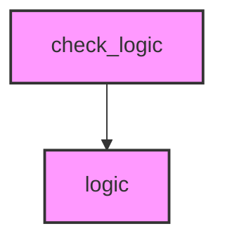

# AI CONTEXT - golden_plugin
Automatically generated by Ai-Context-Core

## 📁 PROJECT STRUCTURE

./
    metadata.txt
    plugin.py
    core/
        __init__.py
        logic.py
    tests/
        check_logic.py

## 🎯 ENTRY POINTS

## 📈 COMPLEXITY AND METRICS
- **Total Modules**: 4
- **Source Lines (SLOC)**: 19
- **Total Physical Lines**: 38
- **Functions**: 6
- **Classes**: 1
- **Avg Cyclomatic Complexity**: 1.2
- **Avg Maintenance Index**: 80.1
- **Most Complex Modules**: core/logic.py, core/__init__.py, plugin.py

## 🔗 PRIMARY DEPENDENCIES
### Third Party (most frequent):
- `qgis` (1 imports)

## 🕸️  DEPENDENCY STRUCTURE
- **Nodes**: 4
- **Edges**: 1
- **Density**: 0.083

## 🕸️ DEPENDENCY DIAGRAM (Conceptual)

## 🔄 GIT AND EVOLUTION
